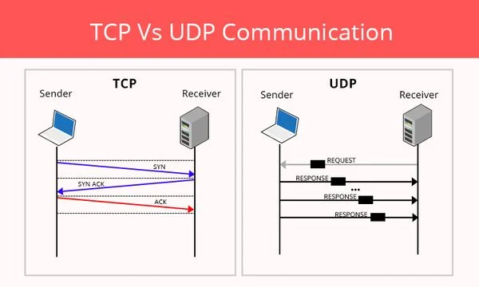

**Sniffing** และ **Spoofing** เป็นเทคนิคที่แตกต่างกันในด้านความปลอดภัยของเครือข่าย:

## Sniffing (การดักฟัง)
- **คือ**: การดักจับและอ่านข้อมูลที่ส่งผ่านเครือข่าย
- **ลักษณะ**: เป็นการ "ฟัง" หรือ "มอง" ข้อมูลแบบ passive (ไม่แทรกแซง)
- **วิธีการ**: ใช้เครื่องมือเช่น Wireshark, tcpdump เพื่อจับ packet ที่ผ่านไป
- **เป้าหมาย**: ได้ข้อมูลอย่าง username, password, email, หรือข้อมูลสำคัญอื่นๆ
- **ตัวอย่าง**: ดักฟังการสื่อสารในเครือข่าย WiFi สาธารณะ

## Spoofing (การปลอมแปลง)
- **คือ**: การปลอมแปลงหรือเลียนแบบตัวตนของเครื่องอื่น
- **ลักษณะ**: เป็นการ "แอบอ้าง" หรือ "ปลอมตัว" แบบ active (มีการแทรกแซง)
- **วิธีการ**: เปลี่ยน MAC address, IP address, หรือข้อมูลระบุตัวตนอื่นๆ
- **เป้าหมาย**: หลอกให้เครื่องอื่นเชื่อว่าเป็นเครื่องที่เชื่อถือได้
- **ตัวอย่าง**: ARP spoofing, DNS spoofing, Email spoofing

## ความแตกต่างหลัก
- **Sniffing** = ดูข้อมูลคนอื่น (การสอดแนม)
- **Spoofing** = ปลอมตัวเป็นคนอื่น (การหลอกลวง)

ทั้งสองเทคนิคมักใช้ร่วมกัน เช่น ใช้ spoofing เพื่อเข้าสู่ตำแหน่งที่สามารถ sniffing ได้ดีขึ้น

